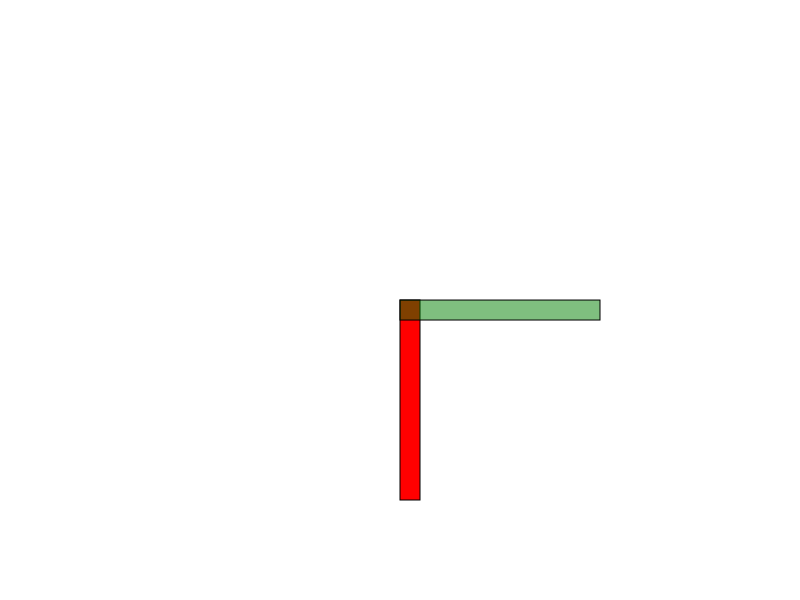

# Tecniche di Programmazione Avanzata - Homework1

Creare un programma C++ che produca un disegno SVG di un dispositivo meccanico. Succesivamente integrato con un altro dispositvo.

## Dispositivo

Sistema aste con perni di rotazioni.
Costituito da 2 aste di dimensioni uguali ognuna con un proprio centro di rotazione.


### Parametri

* lunghezza canvas
* altezza canvas
* posizione X iniziale dispositivo
* posizione Y iniziale dispositivo
* lunghezza dell'asta
* altezza dell'asta
* angolo di rotazione dell' asta di base
* angolo di rotazione dell' asta di giunzione

### Valori vincolati

* dimensioni canvas maggiori di 0
* lunghezza dell'asta maggiore della sua altezza
* dimensioni asta base e asta giunto uguali
* angolo di rotazione dell' asta di base compreso tra i valori 0 - 360
* angolo di rotazione dell' asta di giunzione compreso tra i valori 0 - 360
* centro di rotazione asta base:
````````````````````````````````````````````````````````````````````````````````````
    $ double x_base = altezza / 2 
   
    $ double y_base = lunghezza - x_base
````````````````````````````````````````````````````````````````````````````````````
* centro di rotazione asta giunto:
````````````````````````````````````````````````````````````````````````````````````
    $ double x_base = altezza / 2;

    $ double rotAstaTotx = y_base + dispositivo->astaGiunto.lunghezza - dispositivo->astaGiunto.altezza;

````````````````````````````````````````````````````````````````````````````````````

### Integrazione con un altro dispositivo