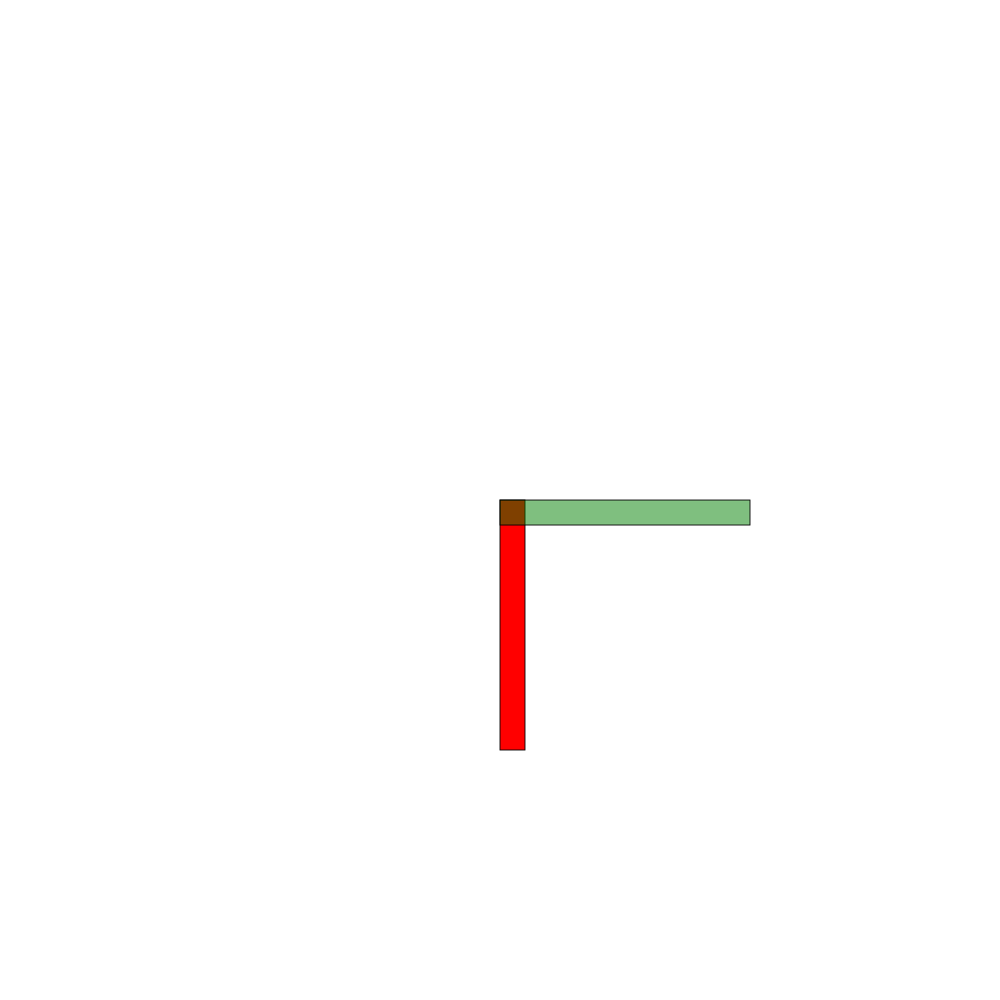

# Tecniche di Programmazione Avanzata - Homework1

Creare un programma C++ che produca un disegno SVG di un dispositivo meccanico. Succesivamente integrato con un altro dispositvo.

## Dispositivo

Sistema aste con perni di rotazioni.
Costituito da 2 aste di dimensioni uguali ognuna con un proprio centro di rotazione.


### Parametri

* lunghezza dell'asta
* altezza dell'asta
* angolo di rotazione dell' asta di base
* angolo di rotazione dell' asta di giunzione

### Valori vincolati

* lunghezza dell'asta sempre maggiore della sua altezza
* angolo di rotazione dell' asta di base compreso tra i valori 45 - 90
* angolo di rotazione dell' asta di giunzione compreso tra i valori 0 - 90
* centro di rotazione asta di base:
````````````````````````````````````````````````````````````````````````````````````
    $ double x_base = altezza / 2 
   
    $ double y_base = lunghezza - x_base
````````````````````````````````````````````````````````````````````````````````````
* centro di rotazione asta di giunzione:
````````````````````````````````````````````````````````````````````````````````````
    $ double x_giunto = centroSVGx + (sin(angBase * M_PI / 180) * dispositivo->astaGiunto.lunghezza) - sin(angBase * M_PI / 180) * dispositivo->astaGiunto.altezza;

    $ double y_giunto = canvasH - ((centroSVGy + (cos(angBase * M_PI / 180) * dispositivo->astaGiunto.lunghezza) -  dispositivo->astaBase.lunghezza)) - (sin(angBase * M_PI / 180) * dispositivo->astaGiunto.altezza / (1 + cos(angBase * M_PI / 180)));

````````````````````````````````````````````````````````````````````````````````````

## Roadmap del progetto

v0.0.0 prime sperimentazioni e studio delle strutture \[in corso\]


v1.0.0 struttura definita; implementazione delle funzioni di inizializzazione del software \
v1.1.0 integrazione di un sistema di verifica degli input \
v1.2.0 integrazione di una prima modalità di rendering del dispositivo \
v1.3.0 implementazione delle funzioni di salvataggio e caricamento

La roadmap deve essere intesa come un cronoprogramma da seguire per la fase di sviluppo e il versionamento del programma, ma può subire variazioni; per dettagli più specifici osservare le note di rilascio.


## Note di rilascio
